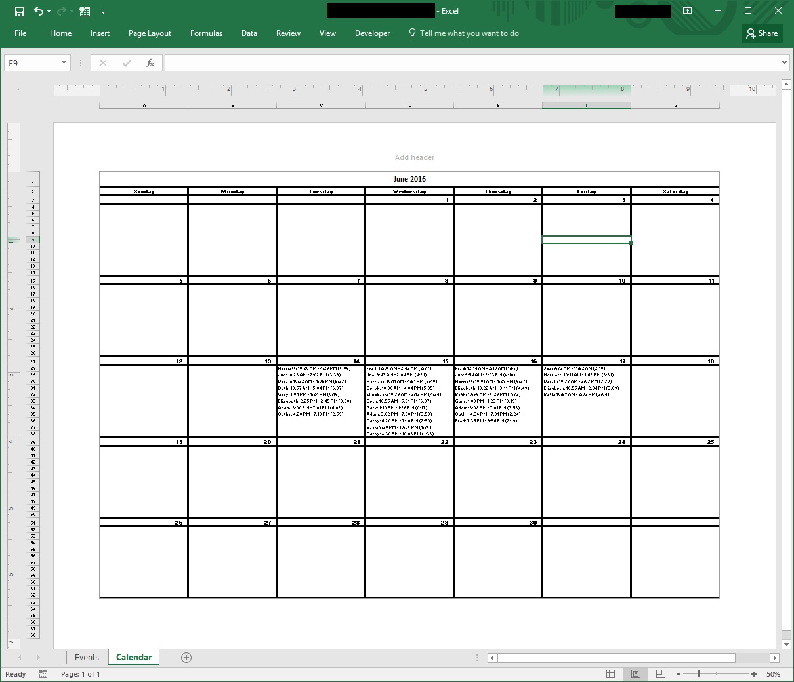

# VBA-Generate-Calendar
VBA macro to generate a calendar in Excel from a list of events.

##Usage

1. Import GenerateCalendar.bas into a new Excel VBA module.  
2. Create 2 worksheets: Events and Calendar.  
3. Add your events list to the Events worksheet, using 1 header row.
At minimum, you should have the following columns: Event Name, Event Date, Event Start Time, Event End Time, and Event Duration.
[Here](https://docs.google.com/spreadsheets/d/13nmTGkXFL6PW17H03rXzOU6fHmeSnu-SOFysATPxFBQ/edit?usp=sharing) is a sample workbook to compare to.  
5. Edit the `Const`s in the code as necessary to match the appropriate columns.  
6. Run the Generate Calendar macro.

#####Recurring Events

To use recurring events, follow the following steps before running the macro (step 6 above):
1. Add a column to the Events sheet, immediately to the right of the data.
2. In this column, for each recurring event, write either `Daily` or `Weekly`.
3. Edit the `RecurringColumn` `Const` to reflect the column number.
4. Add a new blank sheet called `Recurring`.

##License

MIT License

Copyright (c) 2016 Behind The Math

Permission is hereby granted, free of charge, to any person obtaining a copy of this software and associated documentation files (the "Software"), to deal in the Software without restriction, including without limitation the rights to use, copy, modify, merge, publish, distribute, sublicense, and/or sell copies of the Software, and to permit persons to whom the Software is furnished to do so, subject to the following conditions:

The above copyright notice and this permission notice shall be included in all copies or substantial portions of the Software.

THE SOFTWARE IS PROVIDED "AS IS", WITHOUT WARRANTY OF ANY KIND, EXPRESS OR IMPLIED, INCLUDING BUT NOT LIMITED TO THE WARRANTIES OF MERCHANTABILITY, FITNESS FOR A PARTICULAR PURPOSE AND NONINFRINGEMENT. IN NO EVENT SHALL THE AUTHORS OR COPYRIGHT HOLDERS BE LIABLE FOR ANY CLAIM, DAMAGES OR OTHER LIABILITY, WHETHER IN AN ACTION OF CONTRACT, TORT OR OTHERWISE, ARISING FROM, OUT OF OR IN CONNECTION WITH THE SOFTWARE OR THE USE OR OTHER DEALINGS IN THE SOFTWARE.
